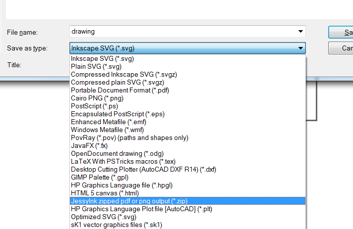

# Adding Pizzazz to Sharpoint

Because if you have ever had to use a sharepoint site, you know that it really needs something.  


## The concept
What I wanted to do is create a little cartoon explosion every time you click somewhere on the page.  

## The explosion (inkscape animation)
The [explosion](boom.svg) was created in inkscape by separating each part of the explosion onto it's own layer and then exporting all the layers via save as -> JessyInk Zipped png  from the main inkscape menu.  



This exports a zip file which has each layer exported as a separate png file.  Once I have all those small files, I use ImageMagic's convert utility to put them all together as an animated gif file

```
convert.exe  -dispose Background -delay 7 -loop 1 -resize 150x150 tempa\\*.png boom.gif
```

and that gets you this (except the real version only loops once)


I was doing this so many times, I put together a small python scripts to do it for me to save some typing: [script](scripts/createAnimation.py)

## The javascript
The next thing I needed to do was get the animation to play wherever the mouse might click happen to click on the page.  I took the lazy route and use jquery to do a lot of the heavy lifting which probably increased the size of the final javascript, but hey, it's only more bits.

To get the position of the mouse click I just attached a mouse click to the document body via Jquery:

````
$(document).click( function(evt) {
.
.
}
````

When the click is activated, it gets the x,y position of mouse via the evt.clientX and evt.clientY properties.  It uses those to update the css left and top values of the image that is holding the animated gif.

but if the gif only plays through once and stops, how do we get to to restart itself for this click?  When the img is first loaded, there is no src attribute on it, and after the image plays once, the src is removed again.  Whenever a src is added to the img container, it causes the animation to play again.

The click function causes the <image> to become visible on the page,  sets the x,y position, and sets the src attribute to point to the animated gif.  Then I set a timeout to unset the src after 700ms.

````
setTimeout( function() {
  $("#boom").attr("src","");
  $("#boom").css("display", "none");
  }, 700);
````

the full source for the example is [here](index.html)

# Packing it up
Getting pretty close to getting this thing into sharepoint, but I needed everything packaged up nicely.  The first thing to tackle was the external image dep, which also solved the problem of changing the src tag of an image which causes it to reload from the server each time.

using [this](http://websemantics.co.uk/online_tools/image_to_data_uri_convertor/result/) page I converted the image into a base64 data url which I stored in a variable.  Now instead of pulling the image from the server, it is now part of the page.  

I then copied the minified jquery library to the top of my script, and modified all the code to be two script blocks.  This was all saved in the file include.txt

# Adding it to sharepoint
Now I had the image, and the code to make everything work.  Just need to get that to play nice on a sharepoint page.

## Steps
* upload the include.txt file to shared documents. this file contains the two script blocks (one for jquery and one for the boom code).
* right click on the uploaded file and save the url to it.
* under site actions select edit page
* add a webpart -> media and content -> content editor web part
* under the Web Part Tools tab unde -> option, select web part properties 
* now in the properties, paste the link you got from your document in the content link section:  

If everything worked, you should now see a little explosion every where you click on the page.
